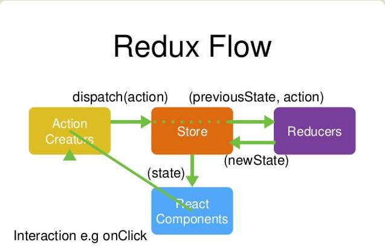

# React-redux 入门（一）


## 一、redux的使用场景

从组件角度看，如果你的应用有以下场景，可以考虑使用 Redux。     

- 某个组件的状态，需要共享

- 某个状态需要在任何地方都可以拿到 

- 一个组件需要改变全局状态 

- 一个组件需要改变另一个组件的状态

发生上面情况时，如果不使用 Redux 或者其他状态管理工具，不按照一定规律处理状态的读写，代码很快就会变成一团乱麻。你需要一种机制，可以在同一个地方查询状态、改变状态、改变状态、传播状态的变化。       

## 二、设计思想

Redux的设计思想很简单，就两句话。      

1. web 应用是一个状态机，视图与状态是一一对应的。   

2. 所有的状态，保存在一个对象里面 

## 基本概念和API

### 3.1 Store

Store 就是保存数据的地方，你可以把它看成一个容器。整个应用只能有一个Store。     

Redux提供`createStore`这个函数，用来生成Store。     

```
import { createStore } from 'redux';

const store = createStore(fn);

```

上面代码中， `createStore` 函数接受另一个函数作为参数，返回新生成的Store对象。     

### 3.2 State

`Store`对象包含所有数据。如果想得到某个时点的数据，就要对Store生成快照。这种时点的数据集合，就叫做State。   

当前时刻的State,可以通过`store.getState()`拿到。    

```
import { createStore } from 'redux';
const store = createStore(fn);
const state = store.getState();

```

Redux规定，一个State对应一个View。只要State相同，View就相同。你知道State，就知道View是什么样子，反之亦然。   

### 3.3 Action

State的变化，会导致View的变化。但是，用户接触不到State，只能接触到View。所以，State的变化必须是View导致的。Action就是View发出的通知，表示State应该发生变化了。    

Action是一个对象。其中的`type`属性是必须的，表示Action的名称。其他属性可以自由设置，社区有一个规范可以参考。      

```
const action = {
  type:'ADD_TODO',
  payload:'Learn Redux'
};
```

上面代码中，Action的名称是`ADD_TODO`，它携带的信息是字符串`Learn Redux`。       
可以这样理解，Action 描述当前发生的事情。改变State的唯一办法，就是使用Action。它会运送数据到Store。      

### 3.4 Action Creator

View 要发送多少种消息，就会有多少种Action。如果都手写，会很麻烦。可以定义一个函数来生成Action，这个函数就叫Action Creator。      

```
const ADD_TODO = '添加 TODO';

function addTodo(text){
  return {
    type:ADD_TODO,
    text
  }
}

const action = addTodo('Learn Redux');

```

上面代码中，`addTodo`函数就是一个Action Creator。     

### 3.5 store.dispatch()

`store.dispatch()`是View 发出 Action的唯一方法。   

```
import { createStore } from 'redux';

const store = createStore(fn);

store.dispatch({
  type:'ADD_TODO',
  payload:'Learn Redux'
});
```

上面代码中，`store.dispatch`接受一个Action对象作为参数，将它发送出去。    

结合 Action Creator,这段代码可以改写如下。   

```
store.dispatch(addTodo('Learn Redux'));

```

### 3.6 Reducer

Store 收到Action以后，必须给出一个新的State，这样View才会发生变化。这种State的计算过程就叫做Reducer。   

Reducer是一个函数，它接受Action和当前State作为参数，返回一个新的State。      

```
const reducer = function (state,action) {
  //...
  return new_state;
};
```

整个应用的初始状态，可以作为State的默认值。下面是一个实际的例子。      

```
const defaultState = 0;

const reducer = (state = defaultState,action) => {
  switch (action.type){
    case 'ADD':
      return state + action.payload;
    default:
      return state;
  }
};

const state = reducer(1,{
  type:'ADD',
  payload:2
});

```


上面代码中，`reducer`函数收到名为`ADD`的Action 以后，就返回一个新的State，作为加法的计算结果。其他运算的逻辑(比如减法)，也可以根据Action的不同来实现。    

实际应用中，Reducer函数不用像上面这样手动调用，`store.dispatch`方法会触发Reducer的自动执行。为此，Store需要知道Reducer函数，做法就是在生成Store的时候，就将Reducer传入`createStore`方法。    

```
import { createStore } from 'redux';
const store = createStore(reducer);
```

上面代码中，`createStore`接受 Reducer作为参数，生成一个新的Store。以后每当`store.dispatch` 发送过来一个新的Action，就会自动调用Reducer，得到新的State。   
为什么这个函数叫做Reducer呢？因为它可以作为数组的`reduce`方法的参数。请看下面的例子，一系列Action对象按照顺序作为一个数组。     

```
const action = [

  { type:'ADD',payload:0 },
  { type:'ADD',payload:1 },
  { type:'ADD',payload:2 },
];

const total = actions.reducer(reducer,0);//3

```

上面代码中，数组`actions`表示一次有三个Action，分别是加`0`、加`1`和加`2`。数组的`reduce`方法接受Reducer函数作为参数，就可以直接得到最终的状态`3`。    

### 3.7 纯函数

Reducer函数最重要的特征是，它是一个纯函数。也就是说，只要是同样的输入，必定得到同样的输出。     

纯函数是函数式编程的概念，必须遵守一下约束。     

- 不得改写参数     

- 不得调用系统 I/O 的API      

- 不得调用 Date.now()或者Math.random()等不纯的方法，因为每次会得到不一样的结果。      

由于Reducer 是纯函数，就可以保证同样的State，必定得到同样的View。但也正因为这一点，Reducer函数里面不能改变State，必须返回一个全新的对象，请参考下面的写法。      


```
// State 是一个对象

function reducer(state,action){
  return Object.assign({},state,{ thingToChange });
  //或者
  return { ...state,...newState};
}

//State 是一个数组

function reducer(state,action){
  return [...state,newItem];
}

```

最好把State对象设成只读。你没办法改变它，要得到新的State，唯一办法就是生成一个新对象。   
这样的好处是，任何时候，与某个View对应的State总是一个不变的对象。    

### 3.8 store.subscribe()

Store 允许使用`store.subscribe`方法设置监听函数，一旦State发生变化，就自动执行这个函数。    

```
import { createStore } from 'redux';

const store = createStore(reducer);

store.subscribe(listener);
```

显然，只要把View的更新函数(对于React 项目，就是组件的`render` 方法或`setState`方法) 放入`listen`，就实现 View 的自动渲染。    

`store.subscribe`方法返回一个函数，调用这个函数就可以解除监听。     

```
let unsubscribe = store.subscribe(() =>
  console.log(store.getState())
);

unsubscribe();
```

## 四、Store的实现

上节介绍了 Redux 涉及的基本概念，可以发现Store提供了三个方法。     

- store.getState()     

- store.dispatch()      

- store.subscribe()    

```
import { createStore } from 'redux';

let { subscribe,dispatch,getState } = createStore(reducer);

```

`createStore`方法还可以接受第二个参数，表示State的最初状态。这通常是服务器给出的。   

```
let store = createStore(todoApp,window.STATE_FORM_SERVER)
```

上面代码中，`window.STATE_FROM_SERVER`就是整个应用的状态初始值。注意，如果提供了这个参数，它会覆盖Reducer 函数的默认值。     

下面是`createStore`方法的一个简单实现，可以了解一下Store是怎么生成的。     

```
const createStore = (reducer) => {
  let state;
  let listeners = [];
  const getState =() => state;
  const dispatch = (action) => {
    state = reducer(state,action);
    listeners.forEach(listener =>listener());
  };
  const subscribe = (listener) => {
    listeners.push(listener);
    return () =>{
      listeners = listeners.filter(1 =>1 !== listener);
    }
  };
  dispatch({});
  return { getState,dispatch,subscribe }
}

```

## 五、Reducer的拆分

Reducer 函数负责生成State。由于整个应用只有一个State 对象，包含所有数据，对于大型应用来说，这个State必然十分庞大。   

请看下面的例子。    

```
const chatReducer = (state = defaultState,action = {}) =>{
  const { type,payload } = action;
  switch (type){
    case ADD_CHAT:
      return Object.assign({},state,{
        chatLog:state.chatLog.concat(payload)
      });
    case CHANG_STATUS:
    return Object.assign({},state,{
      statusMessage:payload
    });
    case CHANGE_USERNAME:
      return Object.assign({},state,{
        userName:payload
      });
    default:return state;
  }
};
```

上面代码中，三种Action分别改变 State的三个属性。    

- ADD_CHAT：chatLog属性

- CHANG_STATUS：statusMessage属性

- CHANGE_USERNAME：userName 属性


这三个属性之间没有联系，这提示我们可以把Reducer 拆分。不同的函数负责处理不同属性，最终把它们合并成一个大的Reducer 即可。   


```
cost chatReducer = (state = defaultState,action = {}) => {
  return {
    chatLog:chatLog(state.chatLog,action),
    statusMessage:statusMessage(state.statusMessage,aciton),
    userName:userName(state.userName,acton)
  }
};
```

上面代码中，Reducer函数被拆成了三个小函数，每个负责生成对应的属性。    

这样一拆，Reducer 就易读易写多了。而且，这个拆分与React应用的结构相吻合：一个React根组件由多个子组件构成。这就是说，子组件与子Reducer完全可以对应。   

Redux提供了一个`combineReducers`方法，用于Reducer 的拆分。你只要定义各个子 Reducer 函数，然后用这个方法。将它们合成一个大的Reducer。   

```
import { combineReducers } from 'redux';

const chatReducer = combineReducers({
  chatLog,
  statusMessage,
  userName
})

export default todoApp;
```

上面的代码通过`combineReducers`方法将三个子 Reducer 合并成一个大的函数。     

这种写法有一个前提，就是State的属性名必须与子Reducer同名。如果不同名，就要采用下面的写法。   

```
const reducer = combineReducer({
  a:doSomethingWithA,
  b:processB,
  c:c
})

//等同于

function reducer(state = {}.action){
  return {
    a:doSomethingWithA(state.a,action),
    b:processB(state.b,action),
    c:c(state.c,action)
  }
}
```


总之，`combineReducers()`做的就是产生一个整体的Reducer函数。该函数根据State的去执行相应的子Reducer,并将返回结果合并成一个大的State对象。     

下面是`combineRedcer`的简单实现。     

```
const combineReducer = reducers =>{
  return (state = {},action)=>{
    return Object.keys(reducers).reduce(
      (nextState.key) => {
        nextState[key] = reducers[key](state[key],action);
        return nextState;
      },
      {}
    );
  };
};
```

你可以把所有子 Reducer 放在一个文件里面，然后统一引入。    

```
import { combineReducers } from 'redux'

import * as reducers from './reducers'

const reducer = combineReducers(reducers)

```

## 六、工作流程

本节对Redux 的工作流程，做一个梳理。   

 

首先用户发出Action。    

```
store.dispatch(action);
```

然后，Store自动调用 Reducer，并且传入两个参数：当前State和收到的Action。 Reducer 会返回新的State。   

```
let nextState = todoApp(previousState,action);

```

State 一旦有变化，Store就会调用监听函数。      

```
//设置监听函数

store.subscribe(listener);
```

`listener`可以通过`store.getState()`得到当前状态。如果使用的是React,这时可以触发重新渲染View。     

```
 function listener() {
    let newState = store.getState();
    component.setState(newState);
 }
```

## 七、实例：计数器

下面我们来看一个最简单的实例。     

```
const Counter = ( { value } ) => (
  <h1>{value}</h1>
);

const render = () => {
  ReactDOM.render = (
    <Counter value={store.getState()}/>,
    document.getElementById('root')
  ) ;
};

store.subscribe(render);
render();

```


上面是一个简单的计数器，唯一的作用就是把参数`value`的值，显示在网页上。Store的监听函数设置为`render`，每次State的变化都会导致网页从新渲染。     

下面加入一点变化，为`Counter`添加递增和递减的Action 。    

```
const Counter = ({value}) =>(
  <h1>{value}</h1>
  <button onClick={onIncrement}> + </button>
  <button onClick={onDecrement}> - </button>
);

const reducer = (state = 0,action) =>{
  switch(action.type){
    case 'INCREMENT': return state +1;
    case 'DECREMENT': return state -1;
    default: return state;
  }
};

const store = createStore(reducer);

const render = () =>{
  ReactDOM.render(
    <Counter
      value = {store.getState()}
      onIncrement={() =>store.dispatch({type:'INCREMENT'})}
      onDecrement={() =>store.dispatch({type:'DECREMENT'})}
    />,
    document.getElementById('root')
  );
};

render();
store.subscribe(render);

```


# Redux 入门教程(二)：中间件与异步操作

上节讲了Redux的基本用法：用户发出 Action，Reducer 函数算出新的State，View 重新渲染。    

但是，一个关键问题没有解决：异步操作怎么办？Action 发出以后，Reducer 立即算出State，这叫做同步；Action发出以后，过一段时间再执行Reducer，这就是异步。怎样才能Reducer在异步操作结束后自动执行呢？就用到新的工具：中间件(middleware)。   

## 一、中间件的概念

为了理解中间件，让我们站在框架作者的角度思考问题：如果要添加功能，你会在哪个环节添加？   

1. Reducer: 纯函数，只承担计算 State的功能，不合适承担其他功能，也承担不了，以为理论上，纯函数不能进行读写操作。     

2. View: 与 State --对应，可以看作State的视觉层，也不合适承担其他功能。   

3. Action:存放数据的对象，即消息的载体，只能被别人操作，自己不能进行任何操作。   

想来想去，只能发送 Action 的这个步骤，即`store.dispatch()`方法，可以添加功能。举例来说，要添加日志功能，吧Action和State打印出来，可以对`store.dispatch`进行如下改造。   

```
let next = store.dispatch;
store.dispatch = function dispatchAndLog(action){
  console.log('dispatching',action);
  next(action);
  console.log('next state',store.getState());
}
```

上面代码中，对`store.dispatch`进行了重新定义，在发送Action前后添加了打印了功能。这就是中间件的雏形。    

中间件就是一个函数，对`store.dispatch`方法进行了改造，在发出Action和执行Reducer这两步之间，添加了其他功能。    


## 二、中间件的用法

中间件是别人已经编写好的，我们常用的中间件都是现成的，只需要引用别人写好的就好。这里只介绍怎么使用中间件。     

```
import { applyMiddleware,createStore } from 'redux';
import createLogger from 'redux-logger';
const logger = createLogger();

const store = createStore(
  reducer,
  applyMiddleware(logger)
);

```

上面代码中，`redux-logger` 提供一个生成器 `createLogger`，可以生成日志中间件`logger`。然后，将它放在`applyMiddleware`方法之中，传入`createStore` 方法，就完成了 `store.dispatch()`的功能增强。   

这里有两点需要注意:  

1. `createStore` 方法可以接受整个应用的初始状态作为参数，那样的话，`applyMiddleware`就是第三个参数了。    

```
const store = createStore(
  reducer,
  initial_state,
  applyMiddleware(logger)
);

```

2. 中间件的次序有讲究。   

```
const store = createStore(
  reducer,
  applyMiddleware(thunk,promise,logger)
);
```

上面代码中，`applyMiddleware` 方法的三个参数，就是三个中间件。有的中间件有次序要求，使用前要检查一下文档。比如，`logger`就一定要放在最后，否则输出结果会不正确。    

## 三、applyMiddlewares()

它是 Redux 的原生方法，作用是将所有中间件组成一个数组，依次执行。下面是它的源码。   

http://www.ruanyifeng.com/blog/2016/09/redux_tutorial_part_two_async_operations.html     

## 四、异步操作的基本思想

同步操作只要发出一种Action即可，异步操作的差别是他要发出三种 Action。   

- 操作发起时的 Action     

- 操作成功时的 Action   

- 操作失败时的 Action   

以向服务器取出数据为例，三种Action 可以有两种不同的写法。    

```
// 写法一：名称相同，参数不同
{ type: 'FETCH_POSTS' }
{ type: 'FETCH_POSTS', status: 'error', error: 'Oops' }
{ type: 'FETCH_POSTS', status: 'success', response: { ... } }

// 写法二：名称不同
{ type: 'FETCH_POSTS_REQUEST' }
{ type: 'FETCH_POSTS_FAILURE', error: 'Oops' }
{ type: 'FETCH_POSTS_SUCCESS', response: { ... } }
```

除了Action类种不同，异步操作的State也要进行改造，反应不同的操作状态。  下面是State的一个例子。    

```
let state = {
  // ... 
  isFetching: true,
  didInvalidate: true,
  lastUpdated: 'xxxxxxx'
};

```

上面代码中，State的属性`isFetching` 表示是否在抓取数据。 `didInvalidate`表示数据是否过时，`lastUpdated` 表示上一次更新时间。   

 现在，整个异步操作的思路就很清晰了。   

 - 操作开始是时，送出一个 Action，触发State更新为“正在操作”状态，View重新渲染。   

 - 操作结束后，再送一个Action，触发State更新为“操作结束”状态，View 再一次重新渲染。   


## 五、redux-thunk 中间件

异步操作至少要发送两个 Action：用户触发第一个Action，这个跟同步操作一样，没有问题；如何才能在操作结束时，系统自动送出第二个Action呢？
奥妙就在于Action Creator 之中。   

```
class AsyncApp extends Component {
  componentDidMount() {
    const { dispatch, selectedPost } = this.props
    dispatch(fetchPosts(selectedPost))
  }

// ...
```

上面代码是一个异步组件的例子。加载成功后(`componentDidMount`方法)，它送出了(`dispatch`方法)一个Action，向服务器要求数据`fetchPosts(selectedSubreddit)`。这里的`fetchPosts`就是Action Creator。    


```
const fetchPosts = postTitle => (dispatch, getState) => {
  dispatch(requestPosts(postTitle));
  return fetch(`/some/API/${postTitle}.json`)
    .then(response => response.json()) //转化成JSON格式
    .then(json => dispatch(receivePosts(postTitle, json)));
  };
};

// 使用方法一
store.dispatch(fetchPosts('reactjs'));
// 使用方法二
store.dispatch(fetchPosts('reactjs')).then(() =>
  console.log(store.getState())
);
```

上面代码中，`fetchPosts`是一个Action Creator(动作生成器),返回一个函数。这个函数执行后，先发出一个Action(requestPosts(postTitle)),然后进行异步操作。拿到结果后，先将结果转化成JSON格式，然后再发出一个Action(receivePosts(postTitle,json))。     


上面代码中，有几个地方需要注意。    

1. `fetchPosts`返回一个函数，而普通的 Action Creator 默认返回一个对象。     

2. 返回的函数的参数是`dispatch`和`getState` 这两个 Redux 方法，普通的Action Creator 的参数是Action的内容。      

3. 在返回的函数之中，先发出一个Action(`requestPosts(postTitle)`),表示操作开始。    

4. 异步操作结束之后，再发出一个Action(`receivePosts(postTitle,json)`),表示操作结束。     

这样的处理，及解决了自动发送第二个Action的问题。但是，又带来了一个新的问题，Action是由`store.dispatch`方法发送的。 而`store.dispatch`方法正常情况下，参数只能是是对象，不能是函数。     

```
import { createStore,applyMiddleware } from 'redux';
import thunk from 'redux-thunk';
import reducer from './reducers';

// Note: this API requires redux@>=3.1.0
const store = createStore(
  reducer,
  applyMiddleware(thunk)
);

```

上面代码使用`redux-thunk`中间件，改造`store.dispatch`,使得后者可以接受函数作为参数。     

因此，异步操作的第一步解决方案就是，写出一个返回函数的Action Creator，然后使用`redux-thunk`中间件改造`store.dispatch`。     

## 六、redux-promise 中间件

既然Action Creator 可以返回函数，当然也可以返回其他值。另一种异步操作的解决方案，就是让Action Creator 返回一个 Promise对象。     

这就需要使用`redux-promise`中间件。      

```

import { createStore, applyMiddleware } from 'redux';
import promiseMiddleware from 'redux-promise';
import reducer from './reducers';

const store = createStore(
  reducer,
  applyMiddleware(promiseMiddleware)
); 

```

这个中间件使得`store.dispatch`方法可以接受Promise对象作为参数。这时，Action Creator 有两种写法。写法一，返回值是一个Promise对象。        

```
const fetchPosts = (dispatch,postTitle) => new Promise(function(resolve,reject){
  dispatch(requestPosts(pastTitle));
  return fetch(`/some/API/${postTitle}.json`)
    .then(response =>{
      type:'FETCH_POSTS',
      payload:response.json()
    });
});

```

写法二，Action 对象的`payload`属性是一个Promise对象。这需要从`redux-actions`模块引入`createAction`方法，并且写法也要变成下面这样。   

```
import { createAction } from 'redux-actions';

class AsyncApp extends Component {
  componentDidMount() {
    const { dispatch, selectedPost } = this.props
    // 发出同步 Action
    dispatch(requestPosts(selectedPost));
    // 发出异步 Action
    dispatch(createAction(
      'FETCH_POSTS', 
      fetch(`/some/API/${postTitle}.json`)
        .then(response => response.json())
    ));
  }

```

上面代码中，第二个`dispatch`方法发出的是异步Action，只有等到操作结束，这个Action才会实际发出。注意，`createAction`的第二个参数必须是一个Promise对象。    

看一下`redux-promise`的源码，就会明白它内部是怎么操作的。      

```
export default function promiseMiddleware({ dispatch }) {
  return next => action => {
    if (!isFSA(action)) {
      return isPromise(action)
        ? action.then(dispatch)
        : next(action);
    }

    return isPromise(action.payload)
      ? action.payload.then(
          result => dispatch({ ...action, payload: result }),
          error => {
            dispatch({ ...action, payload: error, error: true });
            return Promise.reject(error);
          }
        )
      : next(action);
  };
}

```

从上面代码可以看出，如果Action 本身是一个Promise，它resolve以后的值应该是一个Action对象，会被`dispatch`方法送出(`action.then(dispatch)`),但reject 以后不会有任何动作；如果Action对象的`payload`属性是一个Promise对象，那么无论resolve和reject，`dispatch`方法都会发出Action。      


# React-redux 入门（三）
## 一、UI组件

React-Redux将所有组件分成两大类：`UI组件`和`容器组件`。 UI组件有以下几个特征。     

- 只负责UI的呈现，不带有任何业务逻辑   

- 没有状态（即不使用this.state这个变量）      

- 所有数据都由（this.props）提供   

- 不使用任何 Redux 的 API     

例如：  

```
const Title = value =><h1>{value}</h1>;
```

因为不含有状态，UI组件又称为“纯组件”，即和纯函数一样，纯粹由参数决定它的值。     

## 二、容器组件 

容器组件的特征恰恰相反。    

- 负责管理数据和业务逻辑，不负责 UI 的呈现   

- 带有内部状态   

- 使用 Redux 的 API   


`总之，只要记住一句话就可以了：UI组件负责UI的呈现，容器组件负责管理数据和逻辑。`   

但是，如果一个组件既有UI又有业务逻辑，那怎么办？回答是，将它拆分成下面的结构：`外面是一个容器组件，里面包含了一个UI组件。`前者负责与外部的通信，将数据传给后者，由后者渲染出视图。     
 
React-Redux 规定，所有的UI组件都由用户提供，容器组件则是由React-Redux自动生成。也就是说，用户负责视觉层，状态管理则全部交给它。   

## connect()

React-Redux提供`connect`方法，用于从UI组件生成容器组件。connect的意思就是将两种组件连接起来。    

```
import { connect } from 'react-redux';

const VisibleTodoList = connect()(TodoList);
```

上面代码中，`TodoList`是UI组件，`VisibleTodoList`就是由React-Redux通过`connect`方法自动生成的容器组件。     

但是，因为没有定义业务逻辑，上面的这个容器组件毫无意义，只是UI组件的一个单纯的包装层。为了定义业务逻辑，需要给出下面两方面的信息。    

1. 输入逻辑：外部的数据（即`state`对象）如何转换为UI组件的参数     

2. 输出逻辑：用户发出的动作如何变为 Action 对象，从UI 组件传出去。     

因此，`connect`方法的完整API如下。      

```
import { connect } from 'react-redux';

const VisibleTodoList = connect(
  mapStateToProps,
  mapDispatchToProps
)(TodoList)
```

上面代码中，`connect`方法接受两个参数：`mapStateToProps` 和 `mapDipatchToProps`。它们定义了UI组件的业务逻辑。前者负责输入逻辑，即将`state` 映射到UI组件的参数(`props`),后者负责输出逻辑，即 将用户对UI组件的操作映射成Action。    

## 四、mapStateToProps()

`mapStateToProps` 是一个函数。他的作用就是像它名字那样，建立一个（外部的）`state`对象到(UI组件的)`props`对象的映射关系。    

作为函数，`mapStateToProps` 执行后应该返回一个对象，里面的每一个键值就是一个映射。请看下面的例子：     

```
const mapStateToProps = (state) => {
  return {
    todos:getVsibleTodos(state.todos,state.visibilityFilter)
  }
}
```

上面代码中。mapStateToProps 是一个函数，他接受 `state` 作为参数，返回一个对象。这个对象有一个`todos`属性，代表UI组件的同名参数，后面的getVisibleTodos 也是一个函数，可以从`state`算出`todos`的值。    
下面就是`getVisibleTodos`的一个例子，用来算出`todos`。    

```
const getVisibleTodos = (todos,filter) =>{
  switch(filter){
    case'SHOW_ALL':
      return todos
    case 'SHOW_COMPLETED':
      return todos.filter(t =>t.completed)
    case 'SHOW_ACTIVE':
      return todos.filter(t => !t.completed)
    default:
      throw new Error('Unknown filter:'+ filer)
  }
}
```

`mapStateToProps`会订阅 Store,每当`state`更新的时候，就会自动执行，重新计算UI组件的参数，从而触发UI钻进的重新渲染。    

`mapStateToProps`的第一个参数总是`state`对象，还可以使用第二个参数，代表容器组件的`props`对象。    

```
//容器组件的代码
//  <FilterLink filter = "SHOW_ALL">
//  All
//  </FilterLink>

const mapStateToProps = (state,ownProps) =>{
  return {
    active:ownProps.filter === state.visibilityFilter
  }
}
```

使用`ownProps`作为参数后，如果容器组件的参数发生变化，也会引发UI组件重新渲染。      

`connect`方法可以省略`mapStateToProps`参数，那样的话，UI组件就不会订阅Store，就是说Store的更新不会引起UI组件的更新。   

## 五、mapDispatchToProps()

`mapDispatchToProps`是`connect`函数的第二个参数，用来建立UI组件的参数到`store.dispatch`方法的映射。也就是说，它定义了哪些用户的`操作`应当作为Action，传给Store。它可以是一个函数，也可以是一个对象。            

如果`mapDispatchToProps`是一个函数，会得到`dispatch`和`ownProps`(容器组件的`props`对象)两个参数。   

```
const mapDispatchToProps = (
  dispatch,
  ownProps
) => {
  return {
    onClick:() =>{
      dispatch({
        type:'SET_VISIBILITY_FILTER',
        fileter:ownProps.filter
      });
    }
  };
}
```

从上面代码可以看到，`mapDispatchToProps`作为函数，应该返回一个对象，该对象的每个键值对都是一个映射，定义了UI组件的参数怎样发出Action。   

如果`mapDispatchToProps`是一个对象，他的每一个键名也是对应UI组件的同名参数，键值应该是一个函数，会被当做Action creator，返回的Action会由Redux自动发出。举例来说，上面的`mapDispatchToProps` 写成对象就是下面这样。     

```
const mapDispatchToProps = {
  onClick:(filter) =>{
    type:'SET_VISIBILITY_FILTER',
    filter:filter
  };
}
```

## <Provider> 组件   

`connect` 方法生成容器组件以后，需要让容器组件拿到`state`对象，才能生成UI组件的参数。    

一种解决方法是将`state` 对象作为参数，传入容器组件。但是，这样做比较麻烦，尤其是容器组件可能在很深的层级，一级一级将`state`传下去就很麻烦。    

React-Redux提供`Provider`组件，可以让容器组件拿到`state`。      

```
import { Provider } from 'react-redux'

import { createStore } from 'redux'

import todoApp from './reducers'

import App from './components/App'

let store = createStore(todoApp);

render(
  <Provider store = {store}>
    <App />
  </Provider>
  documnet.getElementById('root')
)

```

上面代码中，`Provider` 在根组件外面包了一层，这样一来，`App` 的所有子组件就默认都拿到`state`了。    

它的原理是`React`组件的`context`属性。     

```
class Provider extends Component {
  getChildContext(){
    return {
      store:this.props.store
    };
  }
  render(){
    return this.props.children;
  }
}

Provider.childContextTypes = {
  store:React.PropTypes.object
}
```

上面代码中，`store`放在了上下文对象`context`上面。然后，子组件就可以从`context`拿到`store`,代码大致如下。        

```
class VisibleTodoList extends Component {
  componentDidMount(){
    const { store } = this.context;
    this.unsubscribe = store.subscribe(() =>
      this.forceUpdate()
    );
  }

  render(){
    const props = this.props;
    const { store } = this.context;
    const state = store.getState();
  }
}

VisibleTodoList.contextTypes = {
  store:React.PropTypes.object
}
```

`React-Redux` 自动生成的容器组件的代码，就类似上面这样，从而拿到`store`。     

## 七、实例：计数器

我们来看一个实例。下面是一个计数器组件，它是一个纯的UI组件。       

```
class Counter extends Component {
  render(){
    const { value,onIncreaseClick } = this.props
    return(
      <div>
        <span>{value}</span>
        <button onClick={onIncreaseClick}>Increase</button>
      </div>
    )
  }
}
```

上面代码中，这个UI组件有两个参数：`value`和`onIncreaseClick`。前者需要从`state`计算得到，后者需要向外发出Action。   
接着，定义`value`到`state`的映射，以及`onIncreaseClick`到`dispatch`的映射。     

```
function mapStateToProps(state){
  return {
    value:state.count
  }
}

function mapDispatchToProps(dispatch) {
  return {
    onIncreaseClick: () =>dispatch(increaseAction)
  }
}
const increaseAction = { type:'increase' }

```

然后，使用`connect`方法生成容器组件。     

```
const App = connect(mapStateToProps,mapDispatchToProps)(Counter)
```

然后，定义这个组件的Reducer。

```
function counter(state = { count:0 },action){
  const count = state.count
  switch(action.type){
    case:'increase':
      return { count:count + 1 }
    default:
      return state
  }
}
```

最后，生成`store`对象，并使用`Provider` 在根组件外面包一层。      

```
import { loadState,saveState } from './localStorage';

const persistedState = loadState();
const store = createStore(
  todoApp,
  persistedState
);

store.subscribe(throttle(() =>{
  saveState({
    todos:store.getState().todos,
  })
},1000))

ReactDOM.render(
  <Provider store={store}>
    <App />
  </Provider>,
  document.getElementById('root')
);

```


## 八、React-Router路由库

使用`React-Router`的项目，与其他项目没有不同之处，也是使用`Provider`在`Router`外面包一层，毕竟`Provider`的唯一功能就是传入`store`对象。     

```
const Root = ({ store }) =>(
  <Provider store={store}>
    <Router>
      <Route path="/" component ={App} />
    </Router>
  </Provider>
);

```
