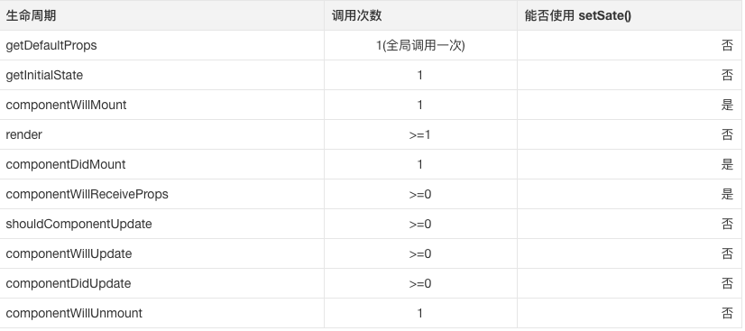
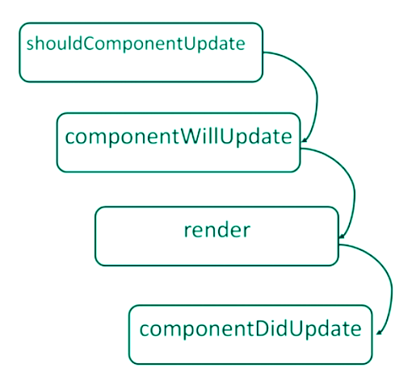

# React 生命周期

React描诉了如何去渲染(DOM)。我们已经知道React使用`render()`方法来达到这个目的。然而仅有`render()`方法可能不一定能够满足我们的需求。如果在组件rendered之前或之后我们需要做些额外的事情该怎么做呢？我恩需要做什么来避免重复渲染呢？      
看起来我们需要对组件(运行)的各个阶段控制，组件运行所有涉及的各个阶段叫做组件的生命周期，并且每个React组件都会经历这个阶段。React提供一些方法并在组件处于相应的阶段通知我们。这些方法叫做React组件的生命周期方法且根据特定并可预测的顺序被调用。      

基本上所有的React组件的生命周期方法都可以被分割成四个阶段：`初始化、挂载阶段(mounting)、更新阶段、卸载阶段(unmounting)`       

## 初始化阶段

初始化阶段就是我们分别通过`getDefaultProps()`和`getInitialState()`方法定义`this.props`默认值和`this.state`初始值的阶段。        

`getDefaultProps()`方法被调用一次并缓存起来一一在多个类实例之间共享。在组件的任何实例被创建之前，我们(的代码逻辑)不能依赖这里的`this.props`。这个方法返回一个对象并且属性如果没有通过父组件传入的话相应的属性会挂载到`this.props`对象上。       

`getInitialState()` 方法也只会被调用一次，(调用时机)刚好是mounting阶段开始之前。返回值将会被当成`this.state`的初始值，且必须是一个对象。     

例如，实现一个显示的值可以被增加和减少的组件，基本上就是一个拥有"+"和"-"按钮的计数器。    

```
var Counter = React.createClass({
  getDefaultProps:function(){
   console.log('getDefaultProps');
   return{
     title:'Basic counter!!!'
   }
  },
  getInitialState:function(){
  console.log('getInitialState');
  return {
      return{
      count:0
      }
   },
   render:function(){
     console.log('render');
     return(
        <div>
             <h1>{this.props.title}</h1>
             <div>{this.state.count}</div>
             <input type='button' value='+' onClick={this.handleIncrement} />
             <input type='button' value='-' onClick={this.handleDecrement} />
        </div>
     );
   },
   handleIncrement:function(){
        var newCount = this.state.count+1;
        this.setState({count:newCount});
   },
   handleDecrement:function(){
        var newCount = this.state.count - 1;
        this.setState({count:newCount});
   },
   propType:{
      title:React.PropType.string
  }
});

ReactDOM.render(
  React.createElement(Counter),
  document.getElementById('app-container')
);
```

我们通过`getDefaultProps()`方法配置一个"title"属性，如果没有传入则提供一个默认值。然后通过`getInitialState()`为组件设置一个初始state值“{count:0}”。运行上边这段代码控制台输出结果：    

```
  getDefaultProps
  getInitialStated
  render
```

现在我们想要让Counter组件可以设置`this.state.count`初始值和增加/减少的步长值，但依然提供一个默认值：    

```
  var Component = React.createClass({
      getDefaultProps:function(){
       console.log('getDefaultProps');
       return{
          title:"Basic counter!!!",
          step:1
       }
      },
      getInitialState:function(){
      console.log('getInitialState');
      return{
        count:(this.props.initialCount ||0)
      };
      },
      render:function(){
       console.log(render);
       var step = this.props.step;
       return(
          <div>
              <h1>{this.props.title}</h1>
              <div>{this.state.count}</div>
              <input type='button' value='+' onClick={this.updateCounter.bind(this,step)} />
              <input type='button' value='-' onClick={this.updateCounter.bind(this,-step)} />
          </div>
       );
      },
      updateCounter:function(value){
        var newCount = this.state.count + value;
        this.setState({count:newCount});
      },
      propType:{
       title:React.PropType.string,
       initialCount:React.PropTypes.number,
       step:React.PropType.number
      }
  });

  ReactDOM.render(
    React.createElement(Component,{initialCount:5,step:2}),
    document.getElementById('app-container')
  );

```


## 增长(Mounting)阶段     

Mounting阶段发生在`组件`即将被插入到DOM之前。这个阶段有两个方法可以用: `componentWillMount()`和`componentDidMount()`。      

componentWillMount()方法是这个阶段最先调用的，它只在刚好初始渲染(initial rendering)发生之前被调用一次，也就是React在DOM插件之前。需要注意的是在此处调用`this.setState()`方法不会触发重新渲染(re-render)。如果添加下面的代码到计数器组件我们将会看到此方法在`getInitalState()`之后且`render()`
之前被调用。      

```
getInitialState:function(){...},
componentWillMount:function(){
   console.log('componentWillMount');
},

```

`componentDidMount()`是这个阶段第二个被调用的方法，刚好发生在React插入组件到DOM之后，且只被调用`一次`。现在可以更新DOM元素了，这意味着这个方法是初始化其他需要访问DOM或操作数据的第三方库的最佳时机。     

假设我们想要通过API拉取数据来初始化组件。我们应该直接在计数器组件的`componentDidMount()`方法拉取数据，但是这让组件看起来有太多逻辑了，更可取的方案是使用容器组件来做：    

```
var Container = React.createClass({
  getInitialState:function(){
    return{
         data:null,
         fetching:false,
         error:null
    };
  },
  render:function(){
     if(this.props.fetching){
         return <div>Loading...</div>;
     }
     if(this.props.error){
         return(
          <div className='error'>
            {this.state.error.message}
          </div>
         );
     }
     return <Counter{...data} />
  },
  componentDidMount:function(){
        this.setState({fetching:true});
        Axios.get(this.props.url).then(function(res){
          this.setState({data:res.data,fetching:false});
        }).catch(function(res){
            this.setState({error:res.data,fetching:false});
        });
  }
});
```

`Axios`是一个基于priomise的跨浏览器和Node.js的HTTP客户端。      

`componentDidMount()` 在组件第一次绘制之后，会调用 componentDidMount(),通知组件已经加载完成。这个函数调用的时候，其虚拟DOM已经构建完成，你可以在这个函数开始获取其中的元素或者子组件了。需要注意的是，ReactNative框架是先调用子组件的componentDidMount(),然后调用父组件的函数。从这个函数开始，就可以和JS其他框架交互了，例如设置计时setTimeout或者setInterval,或者发起网络请求。这个函数也是只被调用一次。这个函数之后，就进入了稳定运行状态，等待事件触发。       





## 更新阶段

当组件的属性或状态更新时也需要一些方法来提供我们执行代码，这些方法也是组件更新阶段的一部分且按照以下的顺序被调用：      

1. 当从父组件接收到新的属性时：    

   

2. 当通过`this.setState()`改变状态时：     

    

此阶段React组件已经被插入DOM了，因此这些方法将不会再首次render时被调用。     

最先被调用的方法是`componentWillReceiveProps()`,当组件接受到新属性时被调用。我们可以利用此方法为React组件提供一个在render之前修改state的机会。在此方法内调用`this.setState()`将不会导致重复render，然后可以通过`this.props`访问旧的属性。例如计数器组件，如果我们想要在任何时候父组件传入“initialCount”时更新状态，可以这样做：    

```
 componentWillReceiveProps:function(newProps){
    this.setState({count:newProps.initialCount});
 },

```

`componentWillReceiveProps(object nextProps):` 组件获取到新的属性时执行，输入参数nextProps是即将被设置的属性，旧的属性还是可以通过this.props来获取。在这个回调函数里面，你可以根据属性的变化，通过调用this.setState()来更新你的组件状态。这里调用更新状态是安全的，并不会触发额外的render()调用。       

 这个方法应该将this.props同nextProps进行比较，然后通过`this.setState()`切换状态      


`shouldComponentUpdate()` 方法允许我们自行决定下一个state更新时是否触发重复render。此方法返回一个布尔值，而且默认值是true。但是我们也可以返回false,这样的话下面的(生命周期)方法将不会被调用:   

- componentWillUpdate() 

- render()  

- componentDidUpdate()


当组件接收到新的属性和状态改变的话，都会触发调用shouldComponentUpdate(...),输入参数nextProps和上面的
componentWillReceiveProps函数一样，nextState表示组件即将更新的状态值。这个函数的返回值决定是否需要更新组件，如果true表示需要更新，继续走后面的更新流程。否则不更新，直接进入等待状态。默认情况下，这个函数永远返回true用来保证数据变化的时候UI能够同步更新。在大型项目中，你可以自己重载这个函数，通过检查变化前后属性和状态，来决定UI是否需要更新，能有效提高应用性能。     

```
var TextComponent = React.createClass({
    shouldComponentUpdate:function(nextProps,nextState){
        if(this.props.text == nextProps) return false;
        return true;
    },
    render:function(){
      return <textarea value={this.props.text} />
    }
});

```

此例中无论何时父组件传入一个"text"属性到`TextComponent` 并且text属性等于当前的“text”属性时，组件将不会重复render。        
当接收到新的属性或者state时在render之前会立刻调用`componentWillUpdate()`方法。可以利用此机会来为更新做一些准备工作，虽然这个阶段不能调用`this.setState()` 方法：    

```
componentWillUpdate:function(nextProps,nextState){
    console.log('componentWillUpdate',nextProps,nextState);
},
```

`componentDidUpdate()` 方法在React更新DOM或者执行些后置动作(action)。此方法有两个参数：    

1. prevProps:旧的属性   

2. prevState: 旧的的state  

这个方法的一个常见使用场景是当我们使用需要操作更新后的DOM才能工作的第三方库--如jQuery插件的时候。在
`componentDidMount()`方法内初始化第三方库，但是在属性或state更新触发DOM更新之后也需要同步更新第三方库来保持接口一致，这些必须在`componentDidUpdate()`方法内完成。为了验证这一点，让我们看看如何开发一个select2库包裹React组件：   

```
var Select2 = React.createClass({
    componentDidMount:function(){
      $(this_ref).select2({date:this.props.items});
    },
    render:function(){
      return(
          <select
            ref={
              function(input){
                this._ref = input;
              }.bind(this)
            }
          >
          </select>
      );
    },
    componentDidUpdate:function(){
      $(this._ref).select2('destroy');
      $(this._ref).select2({data:this.props.items});
    }
});

```

## 卸载阶段

此阶段React只提供了一个方法：   

- componentWIllUnmount()     

它将在组件从DOM卸载之前被调用。可以在内部执行任何可能需要的清理工作，如无效的计数器或者清理一些在
`componentDidMount()`/`componentDidUpdate()`内创建的DOM。


` 生命周期共提供了10不同的API.`

1. getDefaultProps

作用于组件类，只调用一次，返回对象用于设置默认的props,对于引用值，会在实例中共享。     

2. getInitialState

用于组件的实例，在实例创建时调用一次，对于初始每个实例的state,此时可以访问this.props.     

3. componentWillMount

完成首次渲染之前调用，此时仍然可以修改组件的state.(自我理解为是在渲染render函数之前加载，而render函数的中的值还是可以对其进行修改)     

4. render

必选的方法，创建虚拟DOM，该方法具有特殊的规则：    
- 只能通过this.props和this.state访问数据   
- 可以返回null、false或任何React组件   
- 只能出现一个顶级组件(不能返回数组)    
- 不能改变组件的状态     
- 不能修改DOM的输出     

5. componentDidMount

真实的DOM被渲染出来后调用，在该方法中可以通过this.getDOMNode()访问真实的DOM元素。此时已可以使用其他类库来操作这个DOM。在服务端中，该方法不会被调用。    

6. componentWillReceiveProps

组件收到新的`props`时调用，并将其作为参数nextProps使用，并将其作为参数nextProps使用，此时可以更改组件props及state。     

7. shouldComponentUpdate

组件是否应当渲染新的props或state,返回false表示跳过后续的生命周期方法，通常不需要使用以避免出现bug。在出现应用的瓶颈时，可通过该方法进行适当的优化。在首次渲染期间或者调用了forceUpdate方法后，该方法不会被调用    

8. componentWillUpdate 

接收到新的props或者state后，进行渲染之前调用，此时不允许更新props或state.       

9. componentDidUpdate

完成渲染新的props或者state后调用，此时可以访问到新的DOM元素。       

10. componentWillUnmout

组件被移除之前被调用，可以用于做一些清理工作，在cpmponentDidMount方法中添加的所有任务都学要在该方法中撤销，比如创建的定时器或添加的事件监听器。     


